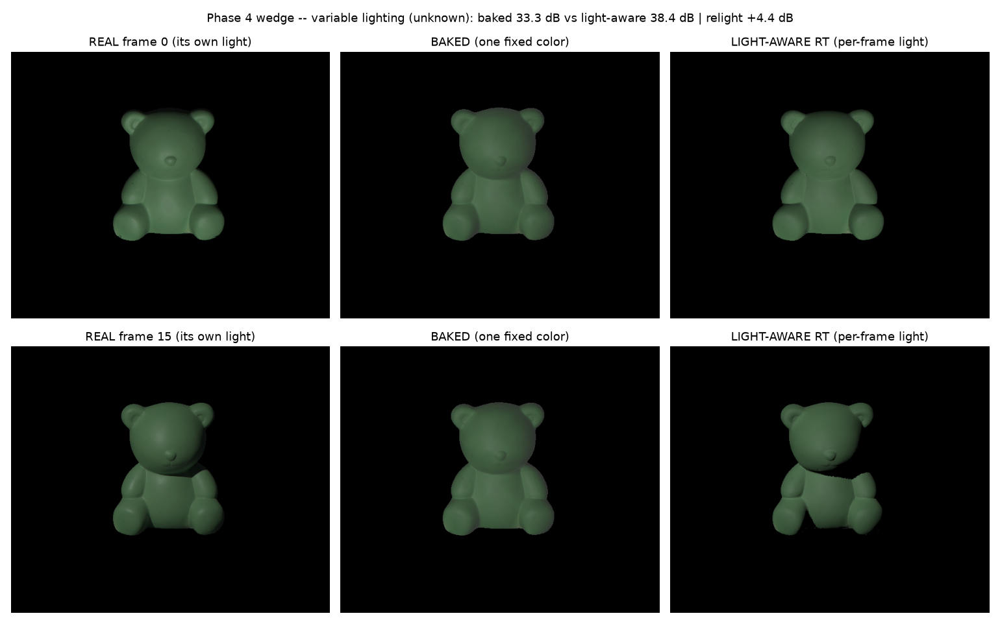

# Light-Aware Gaussian Splatting — De-Lighting & Relighting under Unknown Light

Relightable 3D reconstruction from images captured under **unknown, variable** lighting.
Standard Gaussian Splatting bakes the lighting into one fixed color per Gaussian, so the result
can't be relit. We instead store **material** on the scene (shared across all frames) + a small
**per-frame light**, and *physically shade* one with the other on a **ray-traced backbone**
(3DGRT/OptiX, with exact ray-traced shadows) — so the lighting can be stripped out (de-lit) and
the scene relit arbitrarily, even when the capture lighting is unknown and changes frame to frame.

## "They break, we don't" — on real data, lights unknown



A real object (DiLiGenT-MV bear) shot under **variable per-frame lighting with the lights unknown**.
A **baked** model (one fixed color, like vanilla 3DGS) is stuck at the *average* appearance and
can't follow the changing light. Our **light-aware** model recovers the shared material **and each
frame's light direction from scratch**, reproduces every frame, and relights held-out lights.

> per-frame fit: **baked 33.3 dB → light-aware 38.4 dB (+5.1)** · lights recovered to **~10°** · held-out relight **+4.4 dB**

## Results so far

- **Synthetic ablation (2×2: specular off/on × GI off/on)** — global illumination is the *dominant*
  cue that breaks the material↔light scale ambiguity (a specular highlight alone barely helps);
  with GI + specular the light is recovered to ≈ truth and albedo error drops to ~0.08.
- **Real data (DiLiGenT-MV bear), ray-traced backbone** — **exact ray-traced shadows** recover
  cleaner material than a rasterized shadow-map (data-fit **0.061 vs 0.074**) and relight held-out
  lights better (**39.9 vs 38.0 dB**), with no shadow acne.
- **Variable-light wedge (above)** — light-aware beats baked **+5.1 dB** fit / **+4.4 dB** relight,
  with the per-frame lights detected from scratch.

## Layout

```
src/rt/giop.py        shared GI operator + ray-trace helpers (tune the bounce in ONE place)
src/rt/rt_step1/2/3   synthetic study: scale-drift diagnostic, form-factor bounce, 2x2 ablation
src/rt/rt_dmv.py      real data (DiLiGenT-MV): forward sanity / albedo A/B / relight / wedge
thirdparty/           vendored 3DGRT OptiX tracer + shim (self-contained build, sm_120)
outputs/rt/<config>/  per-config figures
Markdowns/            theory, roadmap, REMINDERS_NOTES (parked ideas: soft-shadow transfer, GI ceiling)
```

## Run (RT backbone, `fullcircle` env)

```bash
conda activate fullcircle
python src/rt/rt_step3.py            # synthetic 2x2 ablation  -> outputs/rt/<config>/step3_2x2.png
python src/rt/rt_dmv.py 1 d          # variable-light wedge on the bear -> outputs/rt/dmv_bear/stageD_wedge.png
```

See [Markdowns/THEORY.md](Markdowns/THEORY.md) for the math and
[Markdowns/REMINDERS_NOTES.md](Markdowns/REMINDERS_NOTES.md) for parked research directions
(the unified soft-shadow transfer — PRT/SG — and the GI-operator fidelity ceiling).
