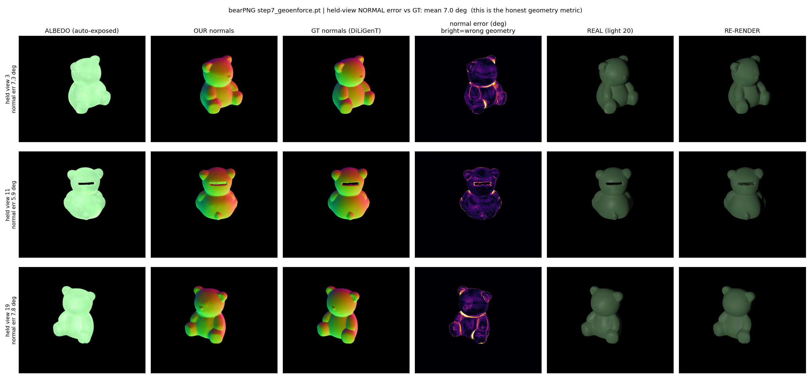

# Light-Aware Gaussian Splatting

De-lighting and relighting of 3D scenes reconstructed from images captured under
**unknown, variable** lighting, on a **ray-traced** Gaussian-Splatting backbone
(3DGRT / OptiX).

Standard Gaussian Splatting bakes illumination into a fixed colour per Gaussian, so the
result cannot be relit. We instead store **material** on the scene (shared across all
frames) together with a small **per-frame light**, and physically shade one with the
other through deterministic ray tracing of the Gaussians — with **exact ray-traced
shadows**. The lighting can then be stripped out (de-lit) and the scene relit under
arbitrary new illumination, even when the capture lighting is unknown and changes frame
to frame.

## Joint reconstruction — no geometry given, lights unknown and per-image



The stronger setting: **no 3D mesh, no normals, no calibrated lights.** The input is only
**posed multi-light images + silhouette masks** (here 17 views × 24 light directions of the
DiLiGenT-MV *bear*), each shot under a *different, unknown* light. From that alone we jointly
recover, in one Gaussian-Splatting optimisation, the **geometry**, a **light-invariant
albedo**, and **every image's light** — then relight.

Two ideas make the joint problem well-posed:

- **The light is *solved*, not learned.** Each step, given the current normals+albedo, the
  per-image light is recovered in closed form (variable projection, specular-robust) — so it
  can never drift to *absorb* shading into a free parameter.
- **Geometry is pinned by an albedo-free normal.** A wrong normal can hide behind a
  compensating albedo (their product still fits the photo). But *ratios* of brightness across
  lights cancel albedo (`b_i/b_j = (n·l_i)/(n·l_j)`), so the multi-light data pins the normal
  independent of albedo; we enforce the geometry's depth-normal to match it.

The figure shows **held-out views** (never trained): recovered albedo (auto-exposed) · our
normals · GT normals · normal-error · real · re-render.

> held-out **normal error 7.0°** vs GT · novel-view relight **40.8 dB / 4.6°** · novel-light
> **41 dB / 4.1°** · **no GT normals used in training** · result unchanged under *randomised*
> per-view lighting (not exploiting the capture grid)

Code: [`src/stage7_joint_geometry_albedo/`](src/stage7_joint_geometry_albedo/) (gsplat backbone, `vision` env).

## Problem

A diffuse image is the product `albedo · light`, so the two cannot be separated from
direct shading alone — any rescaling of one can be absorbed by the other (the
material↔light **scale ambiguity**). The cues that break it are physical:

- **Global illumination.** Indirect (bounced) light scales as albedo², while direct light
  scales as albedo¹; only the *true* scale makes both terms agree.
- **Specular reflection.** A highlight is a near-mirror sample of the light, largely
  independent of albedo.
- **Cast / self-shadows.** Exact ray-traced visibility ties the geometry, light position,
  and material together.

## Method

1. **Backbone.** Deterministic ray tracing of Gaussians (3DGRT/OptiX); we cast our own
   shadow and gather rays. Surface normals come from a dedicated **normal-pass** render
   (the tracer's density-gradient normals are unreliable).
2. **Forward model.** `albedo · max(n·l, 0) · visibility` for the diffuse term, an optional
   **GGX** lobe for specular, and a **precomputed form-factor diffuse bounce** for global
   illumination (the operator is built once on the static geometry and reused every
   optimisation step; albedo is kept *free*, never baked into the transfer).
3. **Inverse.** Recover shared per-Gaussian albedo (+ specular parameters, + per-frame
   light) by differentiable fitting to the images; relight by dropping the light and
   re-shading.

## Result — variable lighting, lights unknown


A real object (DiLiGenT-MV *bear*) shot under variable per-frame lighting with the lights
**unknown**. A baked model (one fixed colour, like vanilla 3DGS) is stuck at the average
appearance and cannot follow the changing light. The light-aware model recovers the shared
material **and each frame's light direction from scratch**, reproduces every frame, and
relights held-out lights.

> per-frame fit **33.3 → 38.4 dB (+5.1)** · lights recovered to **~10°** · held-out relight **+4.4 dB**

## Results summary

- **Synthetic ablation** (2×2: specular off/on × GI off/on). Global illumination is the
  dominant cue that breaks the scale ambiguity — a specular highlight alone barely helps;
  with GI the recovered light approaches truth and albedo error drops to ~0.08.
- **Real data, exact shadows.** Exact ray-traced shadows recover cleaner material than a
  rasterised shadow-map (data-fit **0.061 vs 0.074**) and relight held-out lights better
  (**39.9 vs 38.0 dB**), with no shadow acne.
- **Specular (GGX), known lights.** Adding a GGX lobe improves held-out relight in
  proportion to glossiness — **cow +3.5 dB**, **bear +1.8 dB**, **reading +0.6 dB** — and
  the recovered specular strength tracks the material.

## Repository layout

```
run_diligent.sh                 end-to-end DiLiGenT-MV pipeline (one object, all stages)
src/
  common/                       shared: GI operator + RT helpers (gi_operator.py),
                                scene builders + tracer wrapper (rt_scene.py)
  stage1_synthetic_study/       scale-ambiguity diagnostic → GI bounce → 2×2 ablation
  stage2_real_data_diligent/    DiLiGenT-MV pipeline (forward / albedo A-B / relight /
                                specular / variable-light wedge)
  stage3_shadow_transfer/       soft-shadow treatments (form-factor / SH-PRT / SG) vs GT
  exploration/                  early RT experiments (superseded, kept for record)
  legacy_pre_rt/                pre-pivot raster / OpenIllumination / gsplat work (archived)
thirdparty/                     vendored 3DGRT OptiX tracer + shim (self-contained, sm_120)
outputs/rt/<config>/            per-config figures
Markdowns/                      theory, roadmap, parked research notes
```

Each stage folder has its own `README.md`; see [`src/README.md`](src/README.md) for the map.

## Running

Environment: the `fullcircle` conda env (PyTorch + the 3DGRT/OptiX tracer built for
sm_120 / CUDA 12.8). Run all commands from the repository root.

```bash
conda activate fullcircle

# Real data — full pipeline on one object (scenes: bear cow reading buddha pot2)
./run_diligent.sh bearPNG 1
#   or a single stage:  python src/stage2_real_data_diligent/diligent_pipeline.py <view> <a|b|c|d|e> <scene>

# Synthetic study — the 2×2 ablation
python src/stage1_synthetic_study/step3_ablation_2x2.py

# Soft-shadow comparison (method ∈ gifill | prt | sg)
python src/stage3_shadow_transfer/shadow_compare.py prt
```

DiLiGenT-MV data is expected under `data/diligent_mv/mvpmsData/<scene>/`.

## Status

The diffuse + exact-shadow + GI pipeline and the GGX specular term are in place and
validated on synthetic and real data. Current work: a **unified soft-shadow transfer**
(`stage3`) so shadows are smooth and filled rather than a binary block. Open items
(specular leakage into recovered albedo, per-Gaussian specular, in-the-wild capture) are
tracked in [`Markdowns/REMINDERS_NOTES.md`](Markdowns/REMINDERS_NOTES.md); the theory is
in [`Markdowns/THEORY.md`](Markdowns/THEORY.md).
